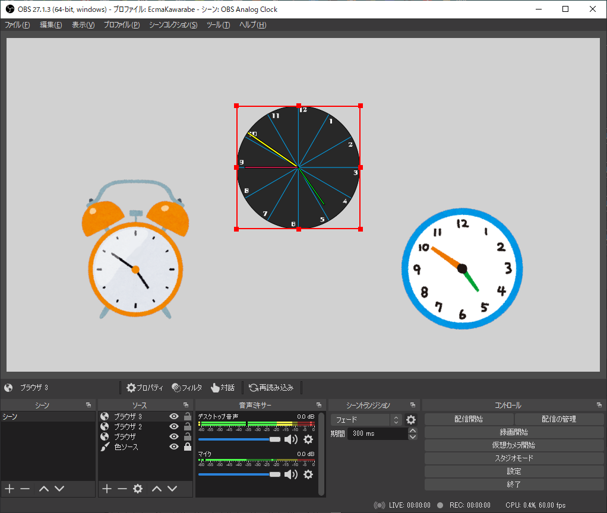
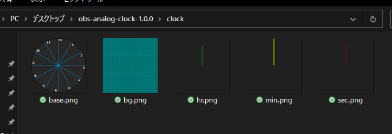
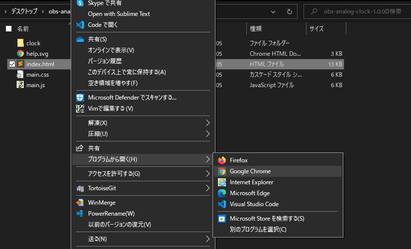
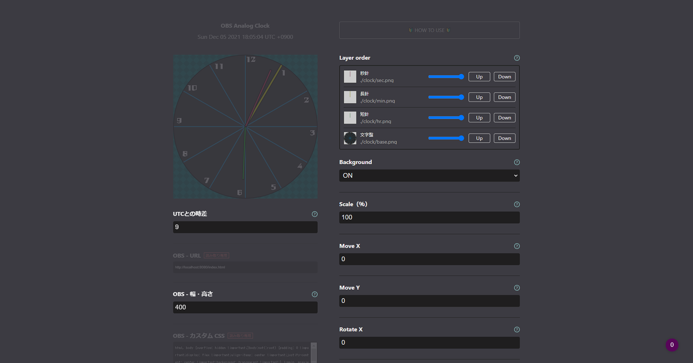
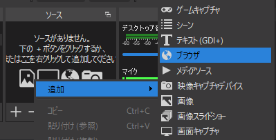
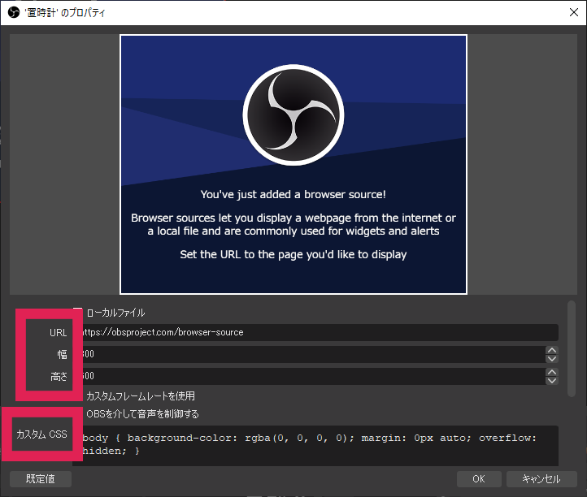
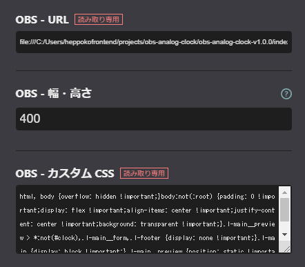
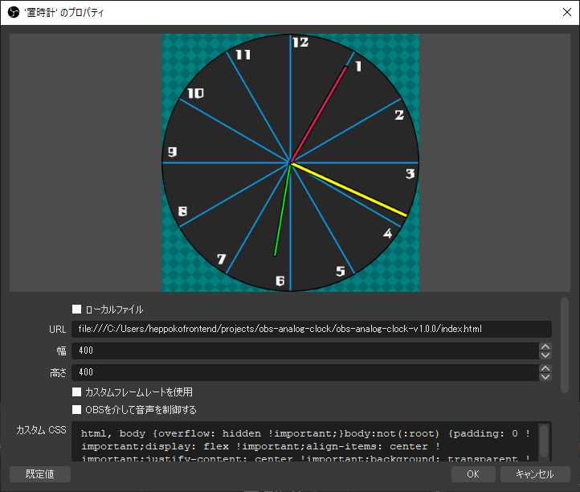

# 🕑 アナログ時計 OBS Analog Clock 【商用利用可・無料】

またの名を「OBS上でアナログ時計を動かすことができるやつ」。

OBS上でアナログ時計を動かすことができるツールです🕑🎉

## 🥒 Download - ダウンロード

こちらからzipファイルをダウンロードしてください。

<https://github.com/heppokofrontend/obs-analog-clock/releases>

## 🔰 How to use - 使い方

**動作確認：**

- Windows 10 Google Chrome 96
- Windows 10 OBS 27.1.3
- 画面幅1920px以上のモニタでの全画面表示のみ対応しています。

### 1. 素材の用意

zipファイルを解凍したら、`clock`フォルダの中をご確認ください。

組み込みたい時計の種類に応じて、これらの画像を参考に時計の画像をご用意ください。

### 2. パラメタの調整

画像の用意ができたら、`index.html`をGoogle Chromeなどのブラウザで開きます。

パラメタの調整画面が開けたら、各種パラメタを調整します。

|パラメタ|デフォルト値|効果|
|:--|:-:|:--|
|`Layer order`|\-|素材の描画順と透明度を管理します。 使わないパーツがあればここで非表示にできます。|
|`Background`|`ON`|`bg.png`を表示するかどうかを切り替えます。|
|`Scale（％）`|`100`|背景画像に対する文字盤の描画サイズを入力します。 文字盤の外側をOBS上で調整する場合は100%で問題ありません。|
|`Move X`|`0`|文字盤をX軸方向に移動させます。|
|`Move Y`|`0`|文字盤をY軸方向に移動させます。|
|`Rotate X`|`0`|X軸（水平）を基準に文字盤を回転させます。|
|`Rotate Y`|`0`|Y軸（垂直）を基準に文字盤を回転させます。|
|`Rotate Z`|`0`|文字盤を傾けます。|
|`Transition - 秒針`|`OFF`|秒針のアニメーションをスムーズにします。|
|`Transition - 長針`|`ON`|長針の位置の計算に秒数とミリ秒を含めます。|
|`Transition - 短針`|`ON`|短針の位置の計算に分を含めます。|
|`UTCとの時差`|`9`|UTCとの時差を入力します。 日本の時差は＋9時間です。|
|`OBS - 幅・高さ`|素材画像の横幅|時計の描画サイズを入力します。 OBSに表示させる際の「幅」と「高さ」はこの値を入力します。 最小サイズは**100px**、最大サイズは**1200px**です。|

## 3. OBSで読み込む

OBSで**ブラウザソース**を任意の名前で追加します。

ブラウザソースの各項目を設定します。

URLとカスタムCSSを、パラメタの調整画面からコピーして設定します。

⚠ **注意：**  
何かパラメタを調整すると、「**OBS - URL**」という項目が更新されます。  
パラメタを調整するたびにブラウザソースの「**URL**」を設定しなおしてください。

設定できたら無事に時計がOBS上に表示されています。

好きな画像素材で、あなたの配信画面にアナログ時計を表示させちゃいましょう！
